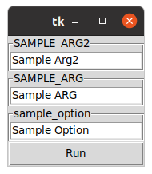

# Unofficial Click UI 
So, you have just designed a new command line app that works for you. 
Now, you have a user base, who is not an IT/Software professional. 

And you need an UI probably!

And a Basic one would suffice?

Then you can use this project/library to quickly create an UI with just 3 Lines of extra code.
1. Add this project in your requirement.txt/setup.py
1. Import the annotation
1. Use the annotation

This project is not promising you any fairytale UI framework. 
It ONLY promises to be less obnoxious to non-IT non-Techinacal people.
If you need something extravagant, you better design your own framework.

Also, I never intend it to be part of any other framework.
As I don't want make any other person to alter their way of working or coding because of this.

## Installation
Currently this project is not published in the pypi index.
I plan to move this to the pypi index when I finally complete developing 1.0.0
As of now, I am using the pypi Test index. 
To install, you need to run the following command:
```bash
pip install -i https://test.pypi.org/simple/ clickui-unofficial
```

## Usage

```python
from clickui import make_ui # This one is from this framework
import click 

# Decorate your existing click command if you need an UI
@make_ui 
@click.command('Sample Command')
def sample_command():
    pass
```
## Screenshot

